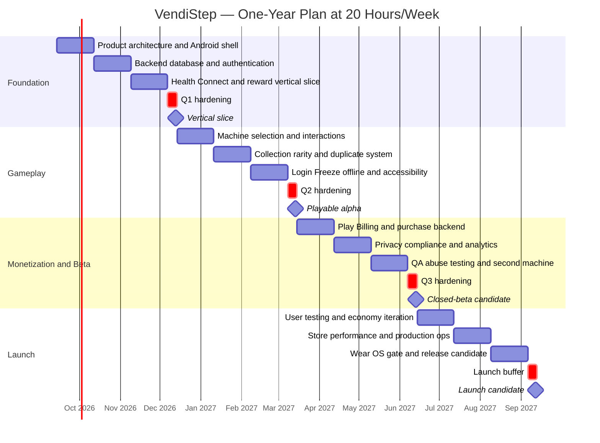
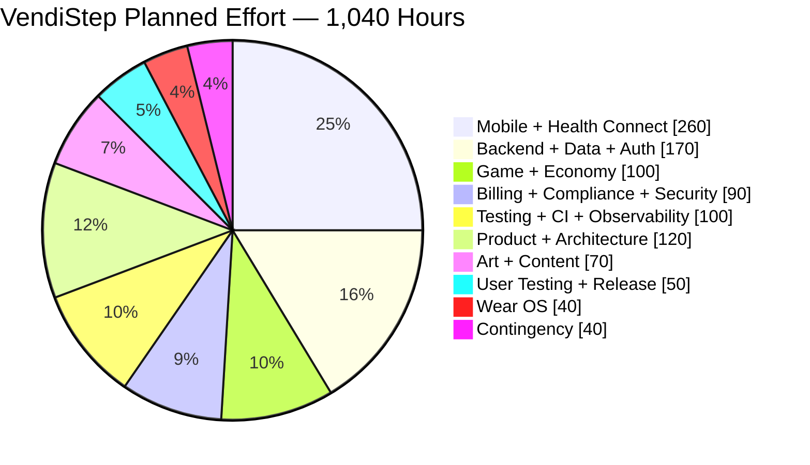

# VendiStep One-Year Development Plan

## Executive Summary

**Planning assumption:** VendiStep is developed primarily by **one solo developer working 20 hours per week for 52 weeks**, giving a total engineering/product budget of approximately **1,040 hours**. The illustrative schedule below begins Monday, **September 14, 2026**, and ends September 12, 2027. Estimates are planning estimates rather than promises; they should be reforecast at the end of each quarter.

The project is feasible in one year **provided the Android phone experience and backend are treated as the actual product and Wear OS remains a gated stretch feature**. The recommended launch scope is two complete vending machines, Health Connect step rewards, daily login rewards, Step Freeze, server-authoritative randomized rolls, collection/inventory, duplicate protection, Google Play Billing, account/privacy controls, and production monitoring. Advanced watch interactions such as animated Legendary collectibles should wait until the core loop proves engaging.

The recommended Android architecture is Kotlin with Jetpack Compose, a layered UI/data architecture using ViewModels and unidirectional state flow, Room for local structured caching, Hilt for dependency injection, and the stable Navigation 3 line. Android's current architecture guidance recommends layered architecture, repositories, coroutines/flows, ViewModels, and Compose for new apps; Hilt is Android's recommended DI library, and Navigation 3 is now stable for Compose-first navigation. citeturn2search5turn18search0turn18search1turn2search2

For activity tracking, VendiStep should request only the Health Connect step permission and use Health Connect's `aggregate()` API for cumulative step totals. Android specifically recommends aggregation for `StepsRecord` because it handles overlap from multiple data sources and avoids double counting. Background Health Connect access is separately permissioned, so the MVP can avoid that permission and reconcile rewards when the user opens the app. citeturn4search2turn16search9

The backend should be **FastAPI + PostgreSQL**, with PostgreSQL—not the Android client—as the authoritative ledger for currency, rolls, inventory and purchases. FastAPI provides typed APIs/OpenAPI and straightforward pytest/TestClient integration, while PostgreSQL provides constraints and transactional consistency suited to token debits, roll results and inventory updates. citeturn19search1turn20search1turn19search2turn20search0

For authentication, the default recommendation is **Firebase Authentication with token verification in FastAPI** rather than implementing password storage yourself. Firebase's documented server flow is for the client to obtain an ID token and the trusted backend to verify it with the Admin SDK. citeturn21search1

The four primary milestones should be:

| Milestone | Target | Definition of done |
|---|---|---|
| **Vertical slice** | End Q1 | Sign in → grant step access → read Health Connect → backend reconciles steps → 5k reward appears in token balance |
| **Playable alpha** | End Q2 | Two-machine architecture, one polished machine, second functional, complete free economy, collection and duplicate handling |
| **Closed-beta candidate** | End Q3 | Both machines polished, Play Billing implemented server-side, privacy/compliance complete, analytics and automated tests running |
| **Launch candidate** | End Q4 | Beta feedback addressed, store testing complete, production monitoring/backups verified, optional Wear OS vertical slice only if core product is healthy |

As of September 2026, new Android phone apps submitted to Google Play must target **Android 16/API 36 or higher**, while new Wear OS apps must target **Android 15/API 35 or higher**. Because VendiStep's intended release is roughly a year away, the target-SDK requirement must be rechecked during Q4 rather than assuming today's requirement will still be sufficient. citeturn17search0turn17search1

The largest risks are not basic Kotlin or Python implementation. They are **scope growth, Health Connect/privacy compliance, trustworthy step-to-currency accounting, billing correctness, randomized-item disclosure, economy tuning, and the amount of original collectible artwork required**. Wear OS is deliberately placed near the end so it cannot endanger the phone launch.

## Scope, Architecture, and Product Decisions

The following translates the handwritten VendiStep notes into a buildable MVP without changing the central concept.

| Feature | MVP working specification | Authority |
|---|---|---|
| Step reward | **1 Roll Token per 5,000 eligible steps** | Server calculates rewards from synchronized Health Connect aggregate |
| Daily login | **1 Roll Token per eligible login day** | Server |
| Weekly activity reward | Current concept: login on **4 of 7 days → 1 Step Freeze** | Server; exact rolling-window rule must be frozen in Q1 |
| Step Freeze | Carries the unfinished remainder below the next 5,000-step threshold | Server |
| Vending roll | Costs **1 token** | Atomic backend transaction |
| Rarity | **Common 50%, Uncommon 30%, Rare 19%, Legendary 1%** | Server-side versioned odds table |
| Duplicate protection | A duplicate improves the next roll's chance of producing a non-duplicate by **5 percentage points** | Precise algorithm must be finalized before Q2 implementation |
| Collection | Obtained items visible; unowned items appear as silhouettes | Backend inventory + Room cache |
| Machines | **2 complete machines at launch** | Data-driven catalog |
| Paid tokens | Working concept: approximately **$1 for 4 rolls** | Google Play Billing consumable |
| Paid Step Freeze | Working concept: approximately **$1 each** | Google Play Billing consumable; validate demand first |
| Authentication | Required for persistent economy and cross-device ownership | Firebase Auth recommended |
| Wear OS | Optional vertical slice | Q4 gate |
| Social/trading/leaderboards | Not MVP | Later |
| Seasonal machines | Not MVP | Later |

A **Step Freeze rule must be formally specified before coding it**. For example, if a player's effective daily total is 12,500, two 5k thresholds have already generated tokens and the remaining 2,500 is the only amount eligible to carry. The unresolved product questions are whether a freeze is automatically used or explicitly armed, whether unused freezes stack in inventory, whether the “4 of 7” requirement is a continuously rolling window or a fixed seven-day reward cycle, and how timezone changes are treated. Those decisions sound small but affect database uniqueness constraints, support issues and exploit resistance.

The safest duplicate-protection implementation for the first release is to preserve the advertised rarity odds. First choose the rarity tier at exactly **50/30/19/1**; then choose the item inside that tier. After a duplicate, the *next* roll can receive a 5-percentage-point rescue chance to replace another duplicate with an unowned item **inside the already selected tier**. That keeps the Legendary tier at 1%. Stacking the bonus, changing tier odds, or adding pity should be deferred until the economy is simulated and the disclosure language can accurately describe the resulting probabilities.

There is also an important mathematical issue in the current 50-item catalog sketch. The notebook proposes 1 Legendary, 5 Rare, 19 Uncommon and 25 Common items. If items are equally likely *within their tier*, the probability of a particular item becomes:

| Tier | Tier probability | Items in machine | Probability of one specific item |
|---|---:|---:|---:|
| Legendary | 1% | 1 | **1.00%** |
| Rare | 19% | 5 | **3.80%** |
| Uncommon | 30% | 19 | **1.58%** |
| Common | 50% | 25 | **2.00%** |

That makes **an individual Rare item easier to obtain than an individual Common, Uncommon or Legendary item**. That is not necessarily wrong, but it is counterintuitive. Before paid rolls are enabled, decide whether “rarity” means *tier occurrence* or *individual collectible scarcity*, then simulate the collection-completion curve.

At 1% independent Legendary odds, a player has only about **39.5% probability of seeing at least one Legendary in 50 rolls** and about **63.4% in 100 rolls**. At the proposed $1 per four rolls, 100 purchased rolls correspond to roughly $25 before regional pricing and platform fees, yet approximately 36.6% of such 100-roll sequences would still contain no Legendary if there is no tier-level pity mechanic. This is not an argument for changing the 1% rate automatically; it is a reason to test perceived fairness before monetization.

**Recommended system architecture:**

| Layer | Choice | Rationale |
|---|---|---|
| Android UI | Kotlin + Jetpack Compose | Compose-first Android development and strong suitability for animated machine/reveal UI. citeturn2search3turn2search5 |
| Navigation/state | Navigation 3 + ViewModel + StateFlow | Fits current Compose architecture recommendations; stable Navigation 3 is available. citeturn18search1turn2search5 |
| DI | Hilt | Officially recommended Android dependency-injection library. citeturn18search0 |
| Local persistence | Room | Structured offline cache with query verification and migration support over SQLite. citeturn2search2 |
| Health | Health Connect, steps only | Central Android health/fitness data API; permissions remain user-controlled. citeturn0search3turn0search5 |
| API | FastAPI REST/OpenAPI | Typed request validation, generated API documentation, straightforward Python testing. citeturn20search1 |
| Persistence | PostgreSQL | Transactions, uniqueness/referential constraints and consistent relational state suit an economy/inventory system. citeturn19search2turn20search0 |
| ORM/migrations | SQLAlchemy 2 + Alembic | Recommended project choice for Python/PostgreSQL; migration execution is kept outside replicated API workers |
| Authentication | Firebase Authentication | Removes password implementation from the FastAPI scope; backend verifies Firebase ID tokens. citeturn21search1 |
| Purchases | Google Play Billing + backend verification | Consumable one-time products match roll-token packs and Step Freezes. citeturn21search10turn21search0 |
| Optional watch | Compose for Wear OS + Data Layer where appropriate | Watch/phone companion architecture is officially supported; standalone versus non-standalone must be declared accurately. citeturn19search0turn7search1 |

The **critical dependency path** should be:

`Identity → Health Connect → daily activity reconciliation → token ledger → roll transaction → item inventory → billing → Wear OS`

That ordering matters. Billing should not be implemented before the free token ledger is trustworthy; duplicate protection should not be implemented before the basic roll algorithm is deterministic and testable; and Wear OS should not begin until the phone/backend contracts are stable.

A practical PostgreSQL model is `users`, `daily_activity`, `login_days`, `token_ledger`, `step_freezes`, `vending_machines`, `items`, `inventory`, `rolls`, `purchases` and `idempotency_keys`. A roll should occur in one database transaction: verify the user, verify sufficient token balance, debit one token, select the result server-side, persist the roll, update inventory/duplicate state, and commit. PostgreSQL's constraints and transaction-isolation mechanisms are specifically intended to maintain consistency under concurrent writes. citeturn19search2turn20search0

The client should **never send “give me one token” or “I rolled a Legendary.”** It sends authenticated observations/actions; the server calculates reward deltas and determines roll outcomes. That makes rooted or modified Android clients less capable of directly rewriting the economy.

For Health Connect specifically, use daily aggregation rather than reading and uploading individual step records. Android recommends `aggregate()` for cumulative step types such as steps because aggregation handles overlapping records from multiple sources. The MVP can synchronize on app launch/resume and reconcile unprocessed days rather than requesting background-health permission simply to keep a counter live. citeturn4search2turn4search3

The UI sketches translate well into a Compose implementation. The home screen should present machines in a horizontally pannable/snap-to-machine arrangement with a mild perspective/fisheye transformation, but the selected machine's name and tap target should remain stable and readable. Entering a machine reveals its item display, Roll button and Drop Box. Unobtained collectibles appear as gray silhouettes; a roll triggers a coin-insertion/machine animation; the server result is persisted before or during that animation; and the player opens the Drop Box for the rarity reveal. The ambient display-light animation from the sketches can cycle slowly → faster → slowly without changing game odds.

For accessibility and robustness, animations should never be the only source of information. Rarity should use a name/icon as well as color; reduced-motion users should be able to shorten effects; sound and haptics should be optional; and if connectivity disappears after a roll request, the client should recover the already-created server roll rather than spending a second token.

## Roadmap, Sprints, and Effort

The schedule uses **24 two-week sprints at 40 hours each plus four one-week review/hardening periods at 20 hours each**:

\[
24 \times 40 + 4 \times 20 = \mathbf{1,040\ hours}
\]

The review weeks are intentionally part of the schedule rather than assuming every hour will produce a new feature.

| Quarter | Sprint | Dates | Primary deliverable | Hrs |
|---|---|---|---|---:|
| Q1 | S1 | Sep 14–27, 2026 | Finalize GameDesign/Economy/DataModels/Architecture docs; acceptance criteria; backlog; CI skeleton | 40 |
| Q1 | S2 | Sep 28–Oct 11 | Compose app shell, design system, Navigation 3, ViewModels, repository interfaces, Room setup | 40 |
| Q1 | S3 | Oct 12–25 | FastAPI scaffold, PostgreSQL schema, migrations, Docker development environment | 40 |
| Q1 | S4 | Oct 26–Nov 8 | Firebase authentication, verified backend identity, account/profile/deletion skeleton | 40 |
| Q1 | S5 | Nov 9–22 | Health Connect onboarding, step permission, daily aggregation, denial/revocation behavior | 40 |
| Q1 | S6 | Nov 23–Dec 6 | Step reconciliation, 5k reward ledger, timezone/idempotency logic, dashboard | 40 |
| Q1 | Review | Dec 7–13 | Integration tests, bug fixing, architecture review, demo | 20 |
| Q2 | S7 | Dec 14–27 | Machine-selection prototype; horizontal pan, snapping and fisheye/perspective experiments | 40 |
| Q2 | S8 | Dec 28–Jan 10 | Machine detail UI; Roll button, coin animation, Drop Box/reveal state | 40 |
| Q2 | S9 | Jan 11–24 | Catalog/inventory/collection; silhouettes and progress; first full machine | 40 |
| Q2 | S10 | Jan 25–Feb 7 | Versioned 50/30/19/1 roll engine; statistical tests; duplicate-protection implementation | 40 |
| Q2 | S11 | Feb 8–21 | Daily login, 4/7 logic, Step Freeze, carry-over, DST/travel edge cases | 40 |
| Q2 | S12 | Feb 22–Mar 7 | Offline/retry/idempotency handling, accessibility baseline, second machine structure | 40 |
| Q2 | Review | Mar 8–14 | Playable alpha, user test round, economy simulation, backlog reset | 20 |
| Q3 | S13 | Mar 15–28 | Google Play Billing client integration and token/Freeze product catalog | 40 |
| Q3 | S14 | Mar 29–Apr 11 | Server purchase verification, consumable grants, idempotency, refund/pending states | 40 |
| Q3 | S15 | Apr 12–25 | Privacy policy, Health declaration, Data Safety, deletion workflow, security audit | 40 |
| Q3 | S16 | Apr 26–May 9 | Analytics, crash/error instrumentation, operational dashboards | 40 |
| Q3 | S17 | May 10–23 | Concurrency, economy simulation, abuse testing, API load/security hardening | 40 |
| Q3 | S18 | May 24–Jun 6 | Second complete machine, art/content pass, audio/animation polish | 40 |
| Q3 | Review | Jun 7–13 | Closed-beta candidate and release-readiness audit | 20 |
| Q4 | S19 | Jun 14–27 | Beta usability iteration, onboarding and economy tuning | 40 |
| Q4 | S20 | Jun 28–Jul 11 | Play internal/closed tracks, store assets, tester recruitment, purchase testing | 40 |
| Q4 | S21 | Jul 12–25 | Device matrix, performance, battery, accessibility and network-failure tests | 40 |
| Q4 | S22 | Jul 26–Aug 8 | Production infrastructure, restore test, monitoring, incident/runbook work | 40 |
| Q4 | S23 | Aug 9–22 | **Conditional Wear OS vertical slice**; otherwise reclaim for phone/backend defects | 40 |
| Q4 | S24 | Aug 23–Sep 5 | Release candidate, final policy check, staged launch and metric validation | 40 |
| Q4 | Review | Sep 6–12 | Launch buffer, urgent fixes, final go/no-go | 20 |

The corresponding high-level Gantt is:

The 1,040-hour budget by workstream is:

| Workstream | Hours | Share |
|---|---:|---:|
| Product discovery/specification/docs | 60 | 5.8% |
| Architecture/scaffolding/tooling | 60 | 5.8% |
| Android core UI/navigation/offline | 160 | 15.4% |
| Backend/API/PostgreSQL/auth | 170 | 16.3% |
| Health Connect and step rewards | 100 | 9.6% |
| Economy/game loop/collection | 100 | 9.6% |
| Billing/compliance/security | 90 | 8.7% |
| Art/content/animation integration | 70 | 6.7% |
| Testing/QA/CI/CD/observability | 100 | 9.6% |
| User testing/store/release | 50 | 4.8% |
| Optional Wear OS vertical slice | 40 | 3.8% |
| Contingency/bug fixing | 40 | 3.8% |
| **Total** | **1,040** | **100%** |

The **Wear OS gate** should be explicit: S23 begins watch development only if there are no unresolved P0/P1 phone defects, billing grants are proven idempotent, the two machines are complete, privacy/account deletion are finished, and the closed beta indicates that the core loop is worth extending. Otherwise those 40 hours become release contingency.

Wear OS itself should initially be modest: step/progress display, current token count, latest collectible and perhaps one animated collectible proof-of-concept. Google recommends watch apps work independently where practical, but explicitly supports a non-standalone declaration when core functionality genuinely depends on a phone. Phone/watch Data Layer communication is suitable for companion synchronization, while persistent content should not rely on Data Layer as if it were the application's cloud backend. citeturn19search0turn7search1

## Platform Compliance, Privacy, and Security

Health Connect is not merely a technical integration. Google treats Health Connect data as **personal and sensitive user data**, and apps using health-related features are subject to Health apps policy requirements. Google specifically gives games that use activity data to advance gameplay as an example of an app that can be in scope; the connection between the health data and gameplay must be clear. citeturn16search1turn16search9

VendiStep therefore should request **only the step permission needed for the walking-reward feature**. Do not request heart rate, sleep, location, calories, body measurements, exercise routes or other health permissions merely because Health Connect makes them available. Both Android and Google Play emphasize data minimization and limiting permissions to the minimum scope required by visible functionality. citeturn15search2turn15search9turn16search9

For steps, Android recommends Health Connect aggregation rather than summing raw `StepsRecord` objects. This is particularly important because records can originate from multiple sources, and aggregation is designed to handle overlapping contributions appropriately. Background reads require additional permission, so the first version can avoid background health access by reconciling activity when the app becomes active. citeturn4search2

A privacy-minimized server design would look like:

| Data | Why VendiStep needs it | Recommended handling |
|---|---|---|
| Firebase user ID | Account ownership | Persistent pseudonymous primary identity |
| Email/display name | Authentication/account UX, if used | Avoid copying to unrelated tables/logs |
| Timezone | Daily login/step boundaries | Store current IANA timezone plus change history if necessary |
| Daily step aggregate | Calculate 5k rewards | Store minimum necessary; do not retain raw Health Connect records |
| Reward/token ledger | Prevent double rewards and reconstruct balance | Persistent until account deletion/valid retention requirement |
| Item inventory/roll history | Collection and support | Persistent game state |
| Purchase token/state | Verify Google Play entitlement | Store securely and uniquely; never log casually |
| Raw health-source records | **Not needed** | Do not upload |
| Heart rate/location/sleep | **Not needed** | Do not request or collect |

Android's security guidance specifically recommends minimizing collection/transmission of user data when logic can work without it, using modern authentication, and protecting data in transit. Google Play likewise requires personal and sensitive data to be handled securely, including modern cryptography such as HTTPS. citeturn15search1turn16search11

VendiStep should therefore keep Health Connect processing mostly on-device and transmit only the minimum daily aggregate required for reward accounting. Analytics should **not receive raw step counts, Health Connect source IDs, or health records**. Track game behavior instead: whether permission was granted, whether a token was earned, rarity rolled, duplicate status, machine chosen and collection progress. This follows the minimum-scope principle and limits exposure of sensitive data to third-party SDKs. citeturn16search9turn15search6

The Google Play release checklist is unusually important for this app:

| Requirement | VendiStep implication |
|---|---|
| **Health apps declaration** | Complete the Health apps declaration because the app accesses activity data for gameplay. citeturn16search1 |
| **Privacy policy** | Must accurately explain access, collection, use, sharing and deletion of personal/sensitive data and be available in the app and Play listing. citeturn16search1turn16search11 |
| **Data Safety** | All published apps must complete the Data Safety form, including third-party SDK behavior. citeturn16search2 |
| **Account deletion** | If accounts can be created, provide both an in-app deletion path and an external web deletion resource. citeturn16search3 |
| **Health permission minimization** | Only request data needed for the visible walking feature. citeturn16search9 |
| **Target API** | As of Sep. 2026, new phone apps require API 36+, Wear OS API 35+; recheck before 2027 release. citeturn17search0 |
| **Random-item odds** | Randomized virtual items obtainable through purchases require odds disclosure before and close to the purchase. citeturn16search0 |
| **Digital-goods billing** | Under standard Play distribution, paid in-app digital currency uses Google Play Billing unless the developer qualifies and enrolls in an applicable alternative-billing program. citeturn16search0turn10search0 |

The gacha-style vending mechanism deserves particular attention. Google's current policy requires apps/games that offer randomized virtual items through a purchase mechanism to disclose the odds **in advance of and in close proximity to the purchase**. Since VendiStep's paid tokens can be spent on randomized vending rolls, the safest implementation is to show the current machine odds on the machine detail page, directly accessible from the Roll button, and again around the paid-token purchase flow. Odds should be versioned server-side so a historical roll can be associated with the exact rules used at that time. citeturn16search0

Paid Roll Tokens and Step Freezes fit Google Play's definition of **consumable one-time products**: digital content/currency or boosts that can be purchased, consumed and purchased again. citeturn21search10

Billing must not be “client says purchase successful → add four tokens.” Google's recommended lifecycle is to verify the purchase, confirm it is in `PURCHASED` state, grant entitlement, then acknowledge/consume it; consumables are consumed so they can be bought again. Google explicitly recommends secure-backend purchase processing, and unprocessed purchases risk refund/revocation. citeturn21search0turn21search4turn21search8

For VendiStep this means a unique `purchase_token` record in PostgreSQL and an idempotent endpoint. If the same purchase reaches FastAPI ten times because of retries, exactly four Roll Tokens should still be granted **once**.

Additional security controls should include HTTPS-only APIs; no secrets in Git; separate development/staging/production secrets; least-privilege database accounts; strict user ownership checks on every economy endpoint; redaction of emails, purchase tokens and health values from logs; rate limits on reward/roll endpoints; periodic backup restoration tests; and server-side validation of every object ID received from Android. Android's security checklist specifically advises protecting secrets, using appropriate secure key storage, minimizing data access and using secure network communication. citeturn15search1turn5search6

Play Integrity can be evaluated as a **Q3 anti-abuse enhancement**, not as a dependency for the first vertical slice. Even with integrity signals, a walking-reward system should assume that perfect prevention of fabricated activity is unrealistic; the economic goal is to make abuse difficult and low-value rather than let the client become authoritative. Android continues to provide Play Integrity mechanisms aimed at detecting abuse patterns. citeturn15search0

## Engineering Quality, CI/CD, and Testing

The development workflow should be **trunk-oriented with short-lived branches**, automated pull-request gates, one staging environment and one production environment. GitHub Actions supports Gradle/Android and Python test workflows; GitHub also supports encrypted secrets, deployment environments and OIDC-based cloud authentication so long-lived cloud credentials do not need to be embedded in CI. citeturn1search3turn12search2turn12search4turn12search5turn12search6

A practical pipeline is:

| Trigger | Automated work | Result |
|---|---|---|
| Pull request | Android compile, lint, JVM unit tests; backend lint/type checks, pytest; migration-on-empty-Postgres test; Docker build | Merge gate |
| Merge to `main` | Repeat tests, build versioned backend image, deploy staging, run database migration once, API smoke tests | Staging |
| Nightly/weekly | Heavier integration/economy simulation; dependency/security review; optional emulator/device tests | Regression signal |
| Android release tag | Signed release AAB, release notes/artifact, internal/closed-track candidate | Play testing |
| Production backend release | Manual GitHub Environment approval → migration → backend rollout → smoke check | Production |
| Failed smoke check | Stop/rollback deployment; do not run destructive automatic database rollback | Incident workflow |

FastAPI's deployment guidance explicitly calls out HTTPS, startup/restart handling, replication and **one-time pre-start operations such as database migrations** as concerns that production deployment needs to handle. citeturn19search1

Testing should be concentrated around the economy rather than chasing a line-coverage percentage.

| Test layer | Highest-value VendiStep cases |
|---|---|
| Pure unit tests | 4,999/5,000/9,999/10,000 boundaries; daily-login eligibility; Step Freeze remainder; rarity mapping; duplicate protection; timezone transitions |
| Backend/API tests | Authentication/authorization, replayed requests, insufficient balance, duplicate purchase tokens, roll recovery, account deletion |
| PostgreSQL integration | Concurrent rolls, double step-sync requests, unique reward constraints, transactional rollback, migrations |
| Android unit tests | ViewModel state, repositories, cached/offline state, error mapping |
| Compose UI tests | Onboarding, machine selection, Roll/Drop Box, collection silhouettes, settings and deletion |
| Health Connect integration | Permission granted/denied/revoked, multiple data origins, no step data, changed totals, offline sync, different Android versions |
| Billing tests | Successful purchase, cancellation, pending state, duplicate callbacks, restore/query, server failure after payment, consumption |
| Statistical simulations | Millions of synthetic rolls to verify configured tier distribution and estimate completion/duplicate curves |
| Manual device testing | Phones from different vendors/sizes/API levels; actual walking sync; process death; poor network; real Wear hardware if watch scope proceeds |

FastAPI directly supports pytest-style testing through `TestClient`, and Compose provides dedicated test APIs for finding, asserting and interacting with UI nodes. Google Play also provides license testing and Play Billing Lab for exercising billing scenarios without treating normal development purchases as live customer transactions. citeturn20search1turn11search0turn21search6

The statistical tests should distinguish **correct configuration** from randomness. A unit test should prove the server uses 50/30/19/1 weights exactly; a large Monte Carlo simulation should then alert you if observed distributions are implausibly far from those configured weights. Do not write a test that expects every block of 100 live rolls to contain exactly one Legendary—randomness does not behave that way.

Health Connect tests need special treatment because permission state is not permanent. Users can deny or later revoke access, and Android recommends applications continue functioning as far as possible using whatever access remains. VendiStep should therefore show the collection and previously earned game state even when current step access is unavailable; only new step reconciliation should pause. citeturn0search5turn4search2

The release quality gates should be project targets rather than market benchmarks:

| Gate | Suggested internal target |
|---|---:|
| P0/P1 known defects | **0** |
| Duplicate paid-token grants in automated scenarios | **0** |
| Duplicate 5k reward grants in concurrency tests | **0** |
| Failed account-deletion test cases | **0** |
| Crash-free sessions during release-candidate beta | **≥99.5%** |
| Common API endpoint p95 latency | **<500 ms** under expected beta load |
| Odds version attached to every roll | **100%** |
| Health permission requested without corresponding feature need | **0** |
| Secrets detected in repository | **0** |
| Backup restore exercise before launch | **Passed** |

If the developer account is a **personal Play developer account created after November 13, 2023**, Google currently requires a closed test with at least **12 testers opted in continuously for at least 14 days** before production access. This makes closed testing a release dependency rather than an optional marketing activity; beginning it several weeks before launch provides time for failed builds or tester drop-off. citeturn11search1

Use Play App Signing for production distribution, keeping the upload key separate from the app-signing key and outside the repository. Google manages the app-signing key under Play App Signing while the developer uses the upload key for submissions. citeturn11search2

## Service Alternatives, Staffing, and Budget

**Hosting comparison**

| Option | Strength | Weakness | Recommendation |
|---|---|---|---|
| **Render** | Fastest operational path for a solo developer; Docker, web services and managed Postgres are available, including free compute options. citeturn22search0 | Less Google-native; advanced architecture may eventually need more explicit infrastructure | **Default solo choice for VendiStep's first year** |
| **Google Cloud Run** | Container-native, pay-per-use model with a current free allowance; fits well with Google APIs and CI/OIDC. citeturn21search2 | IAM, Cloud SQL, networking and billing increase initial DevOps work | Best if learning/using GCP is itself a project goal |
| **Self-managed VPS** | Maximum control and provider portability | Developer owns more HTTPS, restart, patching, backup and deployment concerns—the exact operational issues FastAPI's deployment guide highlights. citeturn19search1 | Avoid for MVP unless server administration is already comfortable |

The recommendation is to keep the FastAPI service **Dockerized and provider-portable**, then use Render through MVP/beta instead of planning a migration that may never be necessary.

**PostgreSQL hosting comparison**

| Database | Strength | Weakness | Fit |
|---|---|---|---|
| **Render PostgreSQL** | Same network/vendor as a Render API; low operational complexity; managed/free options exist. citeturn22search0 | Less bundled backend tooling than Supabase | **Best if API uses Render** |
| **Supabase PostgreSQL** | Managed PostgreSQL plus a large bundled platform; current free tier includes 500 MB DB and Pro starts at $25/month with 8 GB DB and daily backups. citeturn22search1 | Using only its database leaves some paid bundled capabilities unused | Strong alternative |
| **Cloud SQL for PostgreSQL** | Managed Google Cloud PostgreSQL with mature production controls | Compute, memory, storage and network are billed separately; more GCP configuration | Best with Cloud Run/GCP-first architecture. citeturn8search3 |

**Authentication comparison**

| Option | Advantages | Costs/risks | Verdict |
|---|---|---|---|
| **Firebase Authentication** | Android-friendly; FastAPI can verify client ID tokens using Firebase Admin; current pricing includes substantial no-cost authentication usage depending on configuration. citeturn21search1turn22search3 | External identity dependency | **Recommended** |
| **Supabase Auth** | Natural companion if the whole project adopts Supabase; MAU capacity bundled into its plans. citeturn22search1 | Splitting Supabase Auth from a separate backend can add another platform concept | Good if choosing Supabase broadly |
| **Self-managed FastAPI OAuth2/JWT** | Full control; FastAPI documents OAuth2/JWT patterns | You own password hashing, recovery, revocation, compromise response and security maintenance. citeturn3search3 | Avoid for a solo MVP unless auth engineering is intentional |

**Analytics comparison**

| Option | Strength | Privacy consideration | Verdict |
|---|---|---|---|
| **Firebase/Google Analytics** | No-cost Firebase product and natural Android integration. citeturn22search3turn9search1 | Send gameplay events, **not raw Health Connect data** | **Recommended default** |
| **PostHog** | Product analytics, feature flags and experiments; currently includes 1M analytics events/month free. citeturn22search2 | Another third-party SDK/data processor to document and audit | Excellent later if deeper product analysis is needed |
| **Server events only** | Maximum control; no client analytics SDK required | More effort to build dashboards/funnels | Useful for sensitive/economy events regardless of client analytics |

A hybrid is strongest: Firebase Analytics for coarse client UX events, plus authoritative backend events for token awards, rolls and purchases. Health Connect step values should remain outside general-purpose product analytics under the proposed privacy design. Google Play requires developers to account for third-party SDK data behavior in their Data Safety declaration. citeturn16search2turn16search9

**Payment comparison**

| Option | Appropriate for VendiStep? | Reason |
|---|---|---|
| **Google Play Billing** | **Yes — default** | Token packs and Step Freezes are consumable digital products; backend verification is supported/recommended. citeturn21search10turn21search12 |
| **Play alternative-billing program** | Maybe later | Available only under applicable eligibility, enrollment, regional and program requirements. citeturn16search0 |
| **Direct card/Stripe for in-app roll tokens** | **Not the default Play implementation** | Standard Play policy requires the Play billing system for relevant in-app digital goods unless an applicable exception/program applies. citeturn10search0turn16search0 |

Monetization should initially have **one simple token pack and possibly the Step Freeze**, not a sprawling store. The current idea—four rolls for approximately $1—can be tested during beta. A Step Freeze at roughly the same price should be separately validated because its perceived value may differ substantially from four collectible rolls.

Later, non-random cosmetics such as machine skins, profile frames or collection-room themes offer a monetization path that does not depend on additional randomized-item spending. A subscription should be considered only after there is an ongoing, clearly understandable benefit. Advertising is not necessary for MVP; critically, Health Connect data should not become advertising-targeting input. Google Play places strong restrictions around personal/sensitive health data and requires its use to remain consistent with the user-facing functionality and policy requirements. citeturn16search9turn16search11

**Staffing options**

| Model | Approximate capacity | Role structure | Consequence |
|---|---:|---|---|
| **Solo — assumed plan** | 1,040 h/year | One developer owns Android, FastAPI, DB, DevOps, product, QA; art may be contracted | Core phone MVP feasible; Wear remains conditional |
| Lean two-person | ~1,560–2,080 engineer h/year if second person contributes 10–20 h/week | Android/product lead + backend/DevOps engineer | Backend and Android can proceed in parallel; more time for watch/polish |
| Small team | ~1,700–2,500+ h/year depending part-time staffing | Android, backend, part-time UX/art, part-time QA/compliance | Lower key-person risk and better polish; significantly higher cash/coordination cost |

For a solo developer, contracting **art rather than core engineering** is especially attractive: the architecture stays understood by one owner while dozens of collectible assets can be produced in parallel.

**Open-ended first-year cash planning allowance, excluding developer labor:**

| Cost area | Lean planning allowance | Expanded/polished allowance |
|---|---:|---:|
| Google Play developer registration | **$25 one-time** under current registration pricing. citeturn13search0 | Same |
| API + database hosting | $0–$600/year during prototype/beta | $600–$3,600+/year as users/resources grow |
| Development/CI tools | $0–$600/year | $600–$2,000+/year |
| Domain/privacy/deletion site | $20–$150/year | $150–$500+/year |
| Android/Wear test devices | $0 if existing devices suffice | $300–$1,500+ |
| Prototype/stock/original art | $0–$500 | $500–$3,000+ |
| Commissioned two-machine catalog/animation | DIY | **$3,000–$15,000+** planning allowance |
| Privacy/legal review | DIY/$0 | $500–$3,000+ |
| **Broad first-year cash range** | **~$500–$5,000** | **~$5,000–$20,000+** |

Those art, hardware and legal numbers are **budget allowances, not market quotations**; commissioned art is intentionally open-ended because style, number of frames, animation and commercial rights can move the price dramatically. With two 50-item machines, as many as 100 collectible assets may ultimately be needed, making art the biggest non-labor variable.

Infrastructure can begin very cheaply. Render currently offers free compute options; Cloud Run has a request/compute free tier; Supabase offers a free database tier and Pro begins at $25/month. Those vendor prices and limits can change, so infrastructure should be re-priced at each quarter boundary rather than hard-coded into the business plan. citeturn22search0turn21search2turn22search1

Google Play's platform/service-fee structure varies by program and transaction circumstances, so revenue models should use current Play terms rather than assuming one permanent percentage. citeturn10search2turn13search13

## Risk, Metrics, and User Validation

The following risk ratings are planning judgments for this specific project.

| Risk | Probability | Impact | Mitigation / trigger |
|---|---|---|---|
| Solo scope/burnout | High | High | Keep watch optional; enforce two-machine limit; use four review weeks as buffers |
| Health Connect/Play policy rejection | Medium | High | Steps-only permission, early privacy policy/declarations, quarterly compliance audit |
| Economy or duplicate rules remain ambiguous | High | High | Freeze written specifications in S1; version odds/economy server-side |
| Double rewards/race conditions | Medium | High | PostgreSQL uniqueness constraints, transactions, idempotency keys, concurrency tests |
| Billing double-grant/refund bugs | Medium | High | Server verification, unique purchase token, pending/refund tests, RTDN later if required |
| Fabricated step data/modded client | Medium | Medium–High | Server computes rewards, anomaly limits, no cash-out, evaluate Play Integrity |
| Timezone/DST/reward reset bugs | Medium | High | Explicit reward-day model, UTC timestamps + user timezone, travel/DST test matrix |
| Art workload delays release | High | Medium–High | Placeholder art through Q1; style guide; batch production/contracting in Q2–Q3 |
| Fisheye UI feels confusing or causes motion discomfort | Medium | Medium | Prototype S7; snap-to-machine; reduced-motion path; usability testing |
| Paid randomness feels unfair | Medium | High | Show odds clearly; economy simulation; measure completion/duplicate frustration before launch |
| Play closed-test requirement delays release | Medium | High | Begin closed-track work early Q4; recruit more than the minimum tester count where applicable |
| Wear OS consumes core-product time | High | Medium | Hard gate S23; reclaim all 40 h if phone launch is not ready |
| Hosting/vendor lock-in | Low–Medium | Medium | Dockerized FastAPI, standard PostgreSQL, avoid provider-specific business logic |

The **north-star metric** should not simply be DAU or paid rolls. A better VendiStep-specific measure is:

> **Weekly Rewarded Rollers:** unique users in a week who both earn at least one walking-derived token and spend at least one token on a vending-machine roll.

That measures whether the two halves of the product—walking motivation and collecting—are actually connected.

Supporting KPIs should be:

| Area | Measure |
|---|---|
| Onboarding | Health Connect permission acceptance; account completion; onboarding abandonment |
| Activation | % earning first walking token within 7 days; % performing first roll; median time to first roll |
| Retention | D1, D7, D30 retention; active days/week; WAU/MAU |
| Walking loop | Users earning ≥1 walking token/week; walking tokens/user/week |
| Game loop | Rolls/user/week; machines used/user; collection-completion rate; time to first Rare/Legendary |
| Economy | Tokens earned versus spent; balance distribution; duplicate rate; consecutive-duplicate distribution |
| Duplicate protection | Activation rate; success rate; collection-completion effect |
| Step Freeze | Freezes earned, inventory held, usage rate, remainder saved |
| Monetization | Payer conversion, revenue/user, revenue/payer, token-pack mix, Step Freeze purchase rate |
| Billing quality | Purchase completion, pending/cancel/refund rate, entitlement errors, double-grant count |
| Product quality | Crash-free sessions, ANRs, API p50/p95/p99, failed syncs, roll-recovery failures |
| Privacy | Permission revocation rate, deletion success rate, health-data incidents |
| Content | Machine preference and completion rate by machine |

Do **not** use Health Connect data as an advertising profile. Analytics can record events such as `health_permission_granted=true`, `walking_token_earned`, `roll_completed`, `rarity=rare`, `was_duplicate=true`, `freeze_used`, and `purchase_completed`; there is no product-analysis need to send the user's raw daily health record to an analytics provider. This aligns with Google's minimum-scope and sensitive-data principles. citeturn16search9turn15search1

The user-research plan should run continuously instead of waiting for launch:

| Phase | Participants | What to test |
|---|---:|---|
| Q1 vertical slice | 5–8 | “Why does the app need steps?”, permission flow, 5k/token mental model, sync failure |
| Q2 first usability round | 5–6 | Machine carousel/fisheye navigation, collection silhouettes, Roll and Drop Box |
| Q2 second round | 5–6 | Daily login, Step Freeze comprehension, duplicate-protection explanation, rarity UI |
| Q3 beta | 15–25 | Multi-day retention, real walking behavior, economy balance, two-machine preference |
| Q3 billing tests | License testers | Paid token flow, cancellation/pending purchase, recovery after network/server failure |
| Q4 closed beta | 20–50 where practical | Two-week diary usage, monetization understanding, bugs, battery/performance |
| Wear OS gate | 5–10 watch owners | Whether watch information is useful before investing in elaborate animations |

Google recommends dedicated Play Billing testing through license testers and Play Billing Lab, including pending and other purchase-state scenarios. citeturn21search6

Each moderated session should ask the participant to **show**, not merely describe: grant or reject Health Connect permission; identify how to earn a token; explain what happens at 4,999 versus 5,000 steps; find the drop odds; roll an item; determine whether it is new; locate the collection; explain a Step Freeze; and find account deletion. A tester who says “yes, that makes sense” but cannot perform those tasks has identified a UX defect.

The strongest development discipline for the year is therefore to build VendiStep in layers: **prove walking → token first; prove token → satisfying collectible second; prove retention third; add payment fourth; add Wear OS last**. That ordering aligns the one-year, 1,040-hour constraint with the project's highest technical and compliance dependencies while preserving the distinctive ideas from the sketches—the circular/fisheye machine selection, coin-and-drop-box reveal, collectible silhouettes, rarity system, two themed machines, step-based currency and eventual animated watch collectibles.